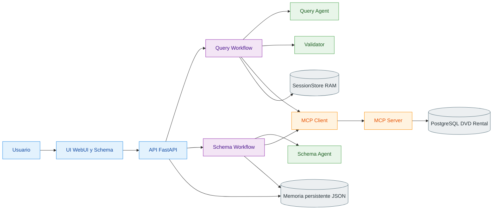
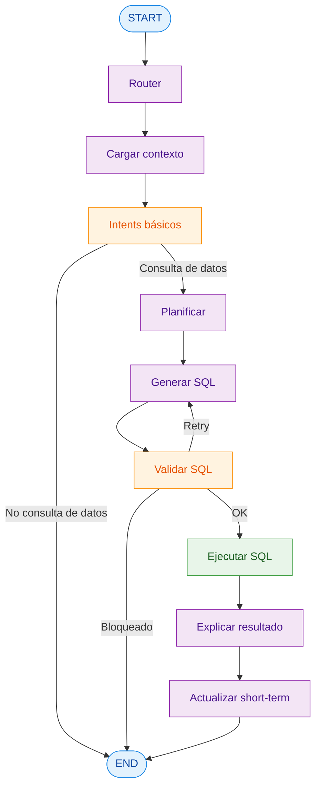
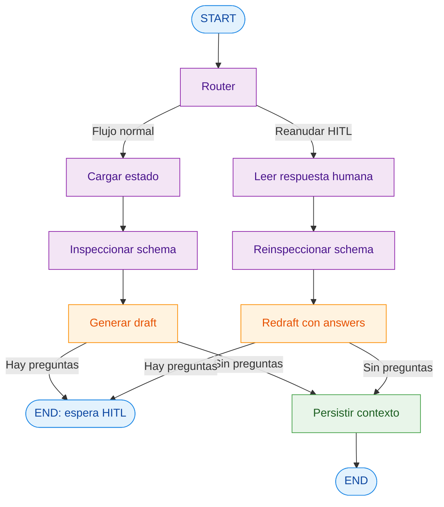

## TP Multiagentes (DVD Rental NLQ)

Implementación de la consigna de `task.md`: sistema NL→SQL sobre PostgreSQL (dataset **DVD Rental**) con **LangGraph**, **dos agentes especializados**, **MCP tools**, **memoria persistente + short-term**, y **HITL** en el flujo de schema.

## Arquitectura (dos agentes + grafo)

### Agentes

- **Schema Agent** (`src/agents/schema_agent.py`): analiza metadata del schema, redacta contexto/descripciones y dispara HITL cuando hay ambigüedad.
- **Query Agent** (`src/agents/query_agent.py`): convierte preguntas en SQL read-only usando contexto de schema, preferencias y memoria de sesión.

### Diagrama de arquitectura (Mermaid)



### Diagrama del Query Graph



### Diagrama del Schema Graph



## Patrones de agentes aplicados

- **Planner/Executor**: `planner.py` decide tablas/supuestos; `query_agent.py` redacta SQL.
- **Critic/Validator**: `validator.py` + `sql_safety.py` validan seguridad y calidad antes de ejecutar.
- **HITL**:
  - obligatorio en flujo de schema (`APPROVE` o `answers` JSON),
  - para SQL riesgoso, se bloquea/reintenta según validación.
- **Router + retries + guardrails**:
  - enrutado de intents básicos (social, capacidades, idioma),
  - reintentos de SQL con feedback de validación,
  - ejecución read-only con límites de seguridad.

## MCP tools y su rol

Servidor MCP separado en `mcp_server/`:

- `db_schema_inspect`: inspección de metadata de schema (tablas, columnas, PK/FK).
- `db_sql_execute_readonly`: ejecución SQL solo lectura con timeout y validaciones.

Cliente MCP en app principal (`src/tools/mcp_client.py`):

- wrappers: `src/tools/mcp_schema_tool.py` y `src/tools/mcp_sql_tool.py`.
- llamadas HTTP a endpoints `POST /tools/db_schema_inspect` y `POST /tools/db_sql_execute_readonly`.
- logging de llamadas (tool, request id, duración, resultado/error).

## Memoria (qué se guarda y por qué)

### Memoria persistente (`DATA_DIR`, ej. `/app/data`)

- `user_preferences.json`:
  - idioma preferido (`es`/`en`),
  - formato de salida (`table`/`json`),
  - formato de fecha,
  - strictness de seguridad SQL,
  - límite por defecto.
  - **Impacto**: afecta prompts, idioma de UI, límites y validación.

- `schema_context.json`:
  - artifact aprobado del Schema Agent (`context_markdown`, `schema_catalog`, `table_names`, `schema_hash`, `questions/answers`, versionado).
  - **Impacto**: se reutiliza en NL→SQL para mayor precisión y menos ambigüedad.

### Memoria de corto plazo (sesión)

- `short_term` en `GraphState` + copia en `SessionStore`.
- Incluye: última pregunta, último SQL draft/ejecutado, tablas recientes, filtros recientes, supuestos, preview del último resultado.
- **Impacto**: permite follow-ups naturales (ej. "solo 2005", "ordená desc", "top 10").

## Setup exacto (Docker, reproducible)

### Requisitos

- Docker + Docker Compose
- Variables LLM OpenAI-compatible (`LLM_BASE_URL`, `LLM_API_KEY`)

### Pasos

1) Crear archivo de entorno:

```bash
cp .env.example .env
```

2) Levantar stack completo:

```bash
docker compose up --build
```

3) Verificar que DVD Rental esté cargada:

```bash
docker compose exec db psql -U dvd_user -d dvdrental -c "\\dt"
```

## Observabilidad con LangSmith (opcional)

Para habilitar trazas del grafo y de llamadas LLM:

- Definí `LANGSMITH_TRACING=true`.
- Definí `LANGSMITH_API_KEY` con una API key válida.
- Opcionalmente ajustá:
  - `LANGSMITH_PROJECT` (default `tp-multiagentes`)
  - `LANGSMITH_ENDPOINT` (default `https://api.smith.langchain.com`)

Si activás tracing sin API key, la app lo desactiva automáticamente y deja un warning en logs para evitar estados inconsistentes.

## Endpoints principales

- `GET /health`
- `GET /tp-agent/playground`
- `GET /schema-agent/playground`
- `GET /schema-agent/ui`
- `POST /v1/chat/completions` (OpenAI-compatible)
- `GET /v1/models`

Schema Agent (operación):

- `GET /schema-agent/state`
- `POST /schema-agent/run`
- `POST /schema-agent/answer`

## Flujo HITL de schema

Cuando el borrador de contexto tiene ambigüedades:

- el sistema responde con checkpoint HITL,
- podés enviar `APPROVE` para aceptar borrador tal cual,
- o enviar `{"answers": {"q1": "...", ...}}` para redraft.

Si no quedan preguntas, el contexto se persiste como aprobado.

## Ejecución segura de SQL

Controles en dos capas:

- **Backend app** (`sql_safety.py` + `validator.py`)
- **Servidor MCP** (`mcp_server/tools/sql.py`)

Reglas: solo lectura, sin DDL/DML, statement único, límites y timeouts.

## UI

- Open WebUI: `http://localhost:3000` (ver `ui/README.md`)
- Schema UI dedicado: `http://localhost:8501`

La UI consume `POST /v1/chat/completions` y `GET /v1/models`.

## Tests y calidad

```bash
uv sync
uv run ruff check --fix
uv run ruff format
uv run pytest
```

Integración MCP opcional:

```bash
RUN_MCP_INTEGRATION=1 uv run pytest tests/integration/
```

## Demo (entrega)

Guion reproducible con:

- sesión de documentación de schema con intervención humana,
- 3 consultas NL distintas,
- 1 refinamiento follow-up,
- todo sobre DVD Rental.

Ver `demo/DEMO.md`.

