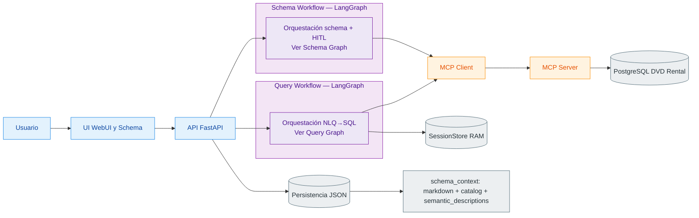
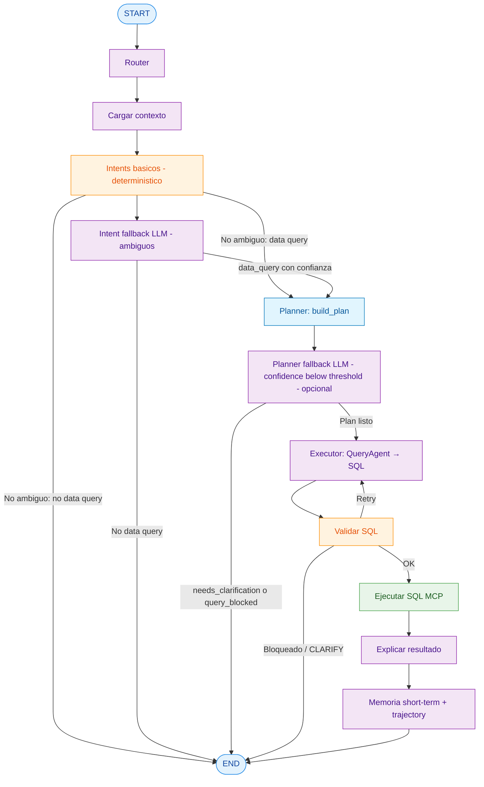
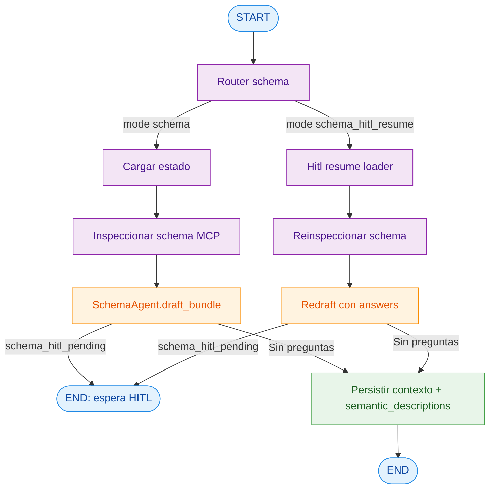

## TP Multiagentes (DVD Rental NLQ)

Implementación de la consigna de `task.md`: sistema NL→SQL sobre PostgreSQL (dataset **DVD Rental**) con **LangGraph**, **dos agentes especializados**, **MCP tools**, **memoria persistente + short-term**, y **HITL** en el flujo de schema.

## Arquitectura (dos agentes + grafo)

### Agentes

- **Schema Agent** (`src/agents/schema_agent.py`): analiza metadata del schema, `**draft_bundle`** (contexto + `semantic_descriptions`) y dispara HITL cuando hay ambigüedad.
- **Query Agent** (`src/agents/query_agent.py`): convierte preguntas en SQL read-only usando contexto de schema, `**query_plan`** del planner, preferencias y memoria de sesión.

Los mismos diagramas viven en `docs/diagrams/` (`.md` con contexto, `.mmd` plano para tooling).

### Diagrama de arquitectura

Este diagrama de arquitectura se mantiene a nivel **alto** (bloques).  
El detalle de nodos internos y rutas está en los diagramas específicos de Query Graph y Schema Graph.




### Diagrama del Query Graph




### Diagrama del Schema Graph




## Patrones de agentes aplicados

- **Router de seguridad por capas**: `basic_intents` hace clasificación determinística de input y, ante ambigüedad, usa fallback LLM para decidir si continúa a query o bloquea con mensaje guiado.
- **Planner/Executor**: `planner.py` arma el plan (tablas, supuestos, `needs_clarification`) con heurística determinística; opcionalmente aplica fallback LLM para refinar tablas/supuestos con baja confianza; luego `query_agent.py` ejecuta NL→SQL con `query_plan` en el prompt.
- **Critic/Validator**: `validator.py` + `sql_safety.py` validan seguridad y calidad antes de ejecutar.
- **HITL**:
  - obligatorio en flujo de schema (`APPROVE` o `answers` JSON),
  - en query riesgosa hoy se aplica bloqueo/reintento automático.
- **Router + retries + guardrails**:
  - enrutado de intents básicos (social, capacidades, idioma),
  - soporte explícito para follow-up refinements (ej. "solamente el primero sin preview"),
  - reintentos de SQL con feedback de validación,
  - ejecución read-only con límites de seguridad.

## Escenarios de input (routing)

El Query Workflow distingue 4 escenarios de entrada antes de ejecutar SQL:

1. **Capacidades del agente**
  Responde qué puede hacer y bloquea ejecución SQL.
2. **Inventario de schema/tablas**
  Devuelve tablas disponibles y bloquea ejecución SQL.
3. **Consulta de datos de dominio**
  Continúa a planner -> QueryAgent -> validator -> execute.
4. **Off-topic / no informativo**
  Bloquea y pide reformulación guiada.

Decisión híbrida:

- Primera capa: reglas determinísticas rápidas.
- Segunda capa (solo ambiguos): `INTENT_FALLBACK_`* con LLM.
- Política conservadora: si hay duda o error del fallback, se bloquea (safe default).

## MCP tools y su rol

Servidor MCP separado en `mcp_server/`:

- `db_schema_inspect`: inspección de metadata de schema (tablas, columnas, PK/FK).
- `db_sql_execute_readonly`: ejecución SQL solo lectura con timeout y validaciones.

Cliente MCP en app principal (`src/tools/mcp_client.py`):

- wrappers: `src/tools/mcp_schema_tool.py` y `src/tools/mcp_sql_tool.py`.
- llamadas HTTP a endpoints `POST /tools/db_schema_inspect` y `POST /tools/db_sql_execute_readonly`.
- logging de llamadas (tool, request id, duración, resultado/error).

## Memoria 

### Memoria persistente

- `user_preferences.json`:
  - idioma preferido (`es`/`en`),
  - formato de salida (`table`/`json`),
  - formato de fecha,
  - strictness de seguridad SQL,
  - límite por defecto.
  - **Impacto**: afecta prompts, idioma de UI, límites y validación.
- `schema_context.json`:
  - artifact aprobado del Schema Agent (`context_markdown`, `schema_catalog`, `table_names`, `schema_hash`, `questions/answers`, versionado).
  - **Impacto**: se reutiliza en NL→SQL para mayor precisión y menos ambigüedad.

### Memoria de corto plazo (sesión)

- `short_term` en `GraphState` + copia en `SessionStore`.
- Incluye: última pregunta, último SQL draft/ejecutado, tablas recientes, filtros recientes, supuestos, preview del último resultado.
- **Impacto**: permite follow-ups naturales (ej. "solo 2005", "ordená desc", "top 10").

## Setup exacto (Docker, reproducible)

### Requisitos

- Docker + Docker Compose
- Variables LLM OpenAI-compatible (`LLM_BASE_URL`, `LLM_API_KEY`)

### Pasos

1. Crear archivo de entorno:

```bash
cp .env.example .env
```

1. Levantar stack completo:

```bash
docker compose up --build
```

1. Verificar carga del dataset obligatorio:

- El contenedor de Postgres restaura DVD Rental automáticamente con `docker/db/init/01_restore_dvdrental.sh`.
- Esperar en logs de `db` el mensaje de restauración exitosa.

```bash
docker compose logs db
```

1. Confirmar que el schema de DVD Rental está disponible antes de ejecutar agentes:

```bash
docker compose exec db psql -U dvd_user -d dvdrental -c "\\dt"
```

### Flags de fallback LLM (routing/planner)

- `INTENT_FALLBACK_ENABLED=true|false`
- `INTENT_FALLBACK_CONFIDENCE_THRESHOLD=0.65`
- `PLANNER_FALLBACK_ENABLED=true|false`
- `PLANNER_FALLBACK_CONFIDENCE_THRESHOLD=0.55`

Perfil recomendado para demo estable con foco en clasificación de input:

- `INTENT_FALLBACK_ENABLED=true`
- `PLANNER_FALLBACK_ENABLED=false`

## Observabilidad con LangSmith

Para habilitar trazas del grafo y de llamadas LLM:

- Definí `LANGSMITH_TRACING=true`.
- Definí `LANGSMITH_API_KEY` con una API key válida.
- Opcionalmente ajustá:
  - `LANGSMITH_PROJECT` (default `tp-multiagentes`)
  - `LANGSMITH_ENDPOINT` (default `https://api.smith.langchain.com`)

Si activás tracing sin API key, la app lo desactiva automáticamente y deja un warning en logs para evitar estados inconsistentes.

En LangSmith vas a ver, para cada `POST /v1/chat/completions`: un **run** titulado `NLQ · …` (preview de la última pregunta usuario), tags `workflow:nlq_query` y `env:…`, y nodos del grafo con nombres explícitos (`load_context`, `basic_intents`, `planner`, `draft_sql_llm`, `validate_sql`, etc.). Las llamadas opcionales a fallback LLM aparecen como `IntentFallback · Safe routing` y `PlannerFallback · Heuristic→LLM`. Cada petición usa un `thread_id` distinto solo para la UI de trazas; la memoria de sesión del grafo sigue usando `session_id` como antes.

## Endpoints principales

- `GET /health`
- `GET /tp-agent/playground`
- `GET /schema-agent/playground`
- `GET /schema-agent/ui`
- `POST /v1/chat/completions` (OpenAI-compatible)
- `GET /v1/models`

Schema Agent (operación):

- `GET /schema-agent/state`
- `POST /schema-agent/run`
- `POST /schema-agent/answer`

## Flujo HITL de schema

Cuando el borrador de contexto tiene ambigüedades:

- el sistema responde con checkpoint HITL,
- podés enviar `APPROVE` para aceptar borrador tal cual,
- o enviar `{"answers": {"q1": "...", ...}}` para redraft.

Si no quedan preguntas, el contexto se persiste como aprobado.

## Ejecución segura de SQL

Controles en dos capas:

- **Backend app** (`sql_safety.py` + `validator.py`)
- **Servidor MCP** (`mcp_server/tools/sql.py`)

Reglas: solo lectura, sin DDL/DML, statement único, límites y timeouts.

## UI

- Open WebUI: `http://localhost:3000` (ver `ui/README.md`)
- Schema UI dedicado: `http://localhost:8501`

La UI consume `POST /v1/chat/completions` y `GET /v1/models`.

## Tests y calidad

```bash
uv sync --extra dev
uv run ruff check --fix
uv run ruff format
uv run pytest
```

Integración MCP opcional:

```bash
RUN_MCP_INTEGRATION=1 uv run pytest tests/integration/
```

Cobertura unitaria relevante:

- intent fallback permite/bloquea correctamente según clasificación,
- follow-up refinements ("solamente el primero sin preview") no se bloquean por falta de anclas,
- fallback de planner con guardrails (sin tablas inventadas),
- manejo de errores en `draft_sql` sin crash global del flujo.

## Teoría -> evidencia en código

- **LangGraph como state machine** -> `src/graph/query_workflow.py`, `src/graph/schema_workflow.py` (nodos, edges, routing, retries, estado explícito).
- **Routing híbrido de intención** -> `query_basic_intents` combina reglas determinísticas y fallback LLM (`INTENT_FALLBACK_ENABLED`, `INTENT_FALLBACK_CONFIDENCE_THRESHOLD`) para decidir ejecución segura.
- **Two-agent decomposition** -> `src/agents/schema_agent.py` + `src/agents/query_agent.py` con responsabilidades separadas.
- **Planner/Executor** -> `src/agents/planner.py` (plan heurístico + fallback LLM opcional con guardrails) + `query_agent` (ejecución NL->SQL dentro del grafo).
- **Critic/Validator** -> `src/agents/validator.py` y `src/tools/sql_safety.py` antes de `query_execute`.
- **HITL en schema** -> `schema_workflow` (`schema_hitl_pending`, checkpoints `APPROVE`/`answers`).
- **Memoria persistente y short-term** -> `src/memory/schema_context_store.py`, `src/memory/user_preferences.py`, `src/memory/short_term.py`, `src/memory/session_store.py`.
- **Descripciones semánticas tabla/columna** -> artefacto `semantic_descriptions` persistido en `schema_context.json` y reutilizado por `query_agent`.
- **MCP desacoplado** -> `mcp_server/tools/`* y cliente `src/tools/mcp_client.py`, wrappers `mcp_schema_tool.py` / `mcp_sql_tool.py`.
- **Observabilidad de trayectoria** -> `trajectory` en `GraphState` + logs de métricas (`node_latency_ms`, retries, bloqueos, token usage, eventos) en ambos workflows.

## Demo

Guion reproducible con:

- sesión de documentación de schema con intervención humana,
- 3 consultas NL distintas,
- 1 refinamiento follow-up,
- todo sobre DVD Rental.

Ver `demo/DEMO.md`.


