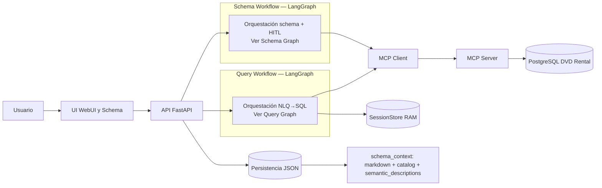
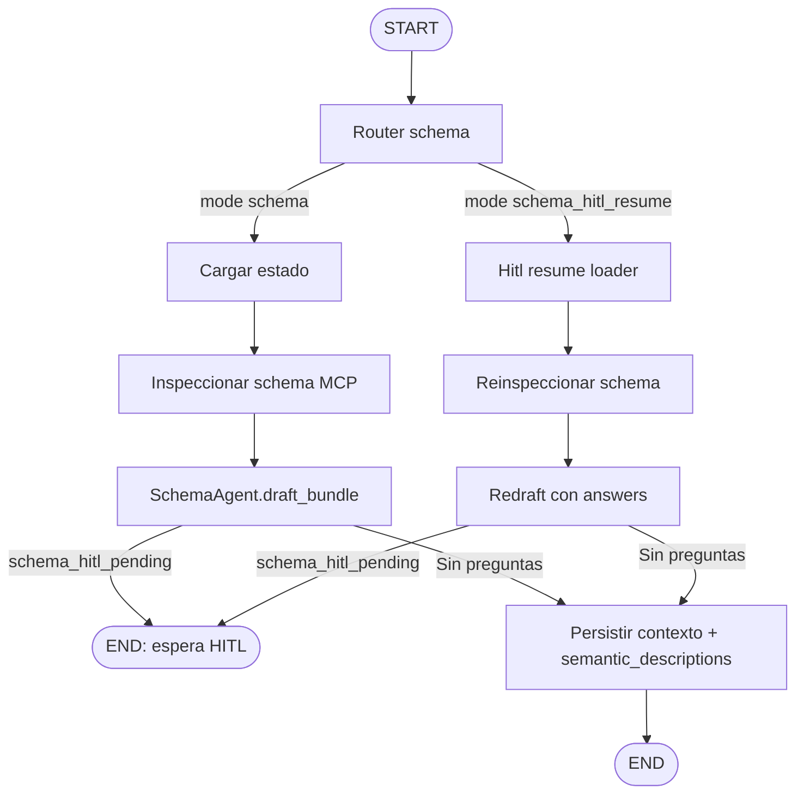

# Reporte corto — TP Multiagentes

## 1) Objetivo y alcance

Este trabajo implementa un prototipo de sistema NLQ (Natural Language Query) sobre PostgreSQL (dataset DVD Rental) con LangGraph, arquitectura de dos agentes y uso de herramientas MCP.  
El objetivo principal fue resolver consultas en lenguaje natural de forma segura y explicable, separando responsabilidades entre:

- **Schema Agent**: inspección/documentación de schema con HITL.
- **Query Agent**: NL -> SQL read-only, validación y explicación de resultados.

El sistema prioriza seguridad, trazabilidad y continuidad conversacional.

---

## 2) Decisiones de arquitectura

### 2.1 Orquestación con LangGraph

Se eligió un grafo explícito para modelar estados y transiciones:

- `query_workflow`: router -> carga contexto/memoria -> planner -> SQL -> validator -> execute -> explain -> memoria.
- `schema_workflow`: router -> inspección schema -> draft -> HITL (si corresponde) -> persistencia.

**Motivación:** tener control determinístico del flujo, guardrails claros y fácil observabilidad por nodo.

### 2.1.1 Routing híbrido de intención (determinístico + fallback LLM)

Se incorporó una segunda capa de clasificación para el ingreso de consultas:

- Capa 1: reglas determinísticas en `basic_intents`.
- Capa 2: fallback LLM para casos ambiguos (`INTENT_FALLBACK_ENABLED`), con salida JSON estricta y umbral de confianza.

Escenarios explícitos de input:

1. `capabilities`
2. `schema_inventory`
3. `data_query`
4. `off_topic`

Solo `data_query` continúa a planner/SQL. Ante duda o error en fallback, la política es **safe default** (bloquear y pedir reformulación).

### 2.2 Dos agentes especializados

- **Schema Agent** recibe metadata real del schema y produce contexto persistente para consultas futuras.
- **Query Agent** usa pregunta + contexto + memoria para redactar SQL read-only.

**Motivación:** separar “conocimiento estructural del dominio” de “ejecución de consulta”, reduciendo ambigüedad y acoplamiento.

### 2.2.1 Planner híbrido y decisión operativa

El planner quedó preparado en dos niveles:

- nivel heurístico determinístico (rápido y barato),
- fallback LLM opcional (`PLANNER_FALLBACK_ENABLED`) para baja confianza.

Decisión para demo y operación estable: priorizar fallback LLM en **intent routing** y dejar el fallback del planner configurable (incluso desactivado) para reducir latencia/costo cuando no es necesario.

### 2.3 MCP como capa de acceso a datos

Se implementó servidor MCP separado (`mcp_server`) y cliente MCP en backend (`src/tools/mcp_client.py`), con dos tools principales:

- `db_schema_inspect`
- `db_sql_execute_readonly`

**Motivación:** aislar acceso a DB, mejorar seguridad operacional y trazabilidad de tool calls.

---

## 2.4 Diagramas de arquitectura y workflows

### 2.4.1 Arquitectura general (alto nivel)



### 2.4.2 Query Workflow (detalle)

```mermaid
flowchart TD
    A([START]) --> R[Router]
    R --> L[Cargar contexto]
    L --> I[Intents básicos (determinístico)]
    I --> IFB[Intent fallback LLM (ambiguos)]

    I -->|No ambiguo: no data query| Z([END])
    I -->|No ambiguo: data query| P[Planner: build_plan]
    IFB -->|No data query| Z
    IFB -->|data_query con confianza| P

    P --> PF[Planner fallback LLM (confidence<threshold, opcional)]
    PF -->|needs_clarification o query_blocked| Z
    PF -->|Plan listo| S[Executor: QueryAgent → SQL]

    S --> V[Validar SQL]

    V -->|Retry| S
    V -->|Bloqueado / CLARIFY| Z
    V -->|OK| E[Ejecutar SQL MCP]

    E --> X[Explicar resultado]
    X --> M[Memoria short-term + trajectory]
    M --> Z
```

### 2.4.3 Schema Workflow (detalle)



---

## 3) Patrones aplicados

Se aplicaron los patrones pedidos en la consigna:

- **Planner/Executor**: planificación heurística de tablas/supuestos (`planner.py`) antes de generar SQL, con fallback LLM opcional para refinamiento.
- **Critic/Validator**: validación de SQL (`validator.py` + `sql_safety.py`) antes de ejecutar.
- **HITL**: checkpoint humano en flujo de schema cuando hay ambigüedades.
- **Router/Guardrails/Retries**: detección de intents básicos, fallback LLM para ambiguos, reintentos controlados y bloqueos de seguridad.

Nota: la arquitectura implementada es de orquestación por grafo, no un agente autónomo tipo ReAct tool-calling. En query riesgosa se aplica validación + bloqueo/retry; no hay HITL explícito en ese flujo.

---

## 3.1 Flujo nodo por nodo

### Query Workflow (`src/graph/query_workflow.py`)

1. **`mark_query_mode`**  
   Marca la ejecución como consulta (`mode="query"`) para entrar al subgrafo correcto.

2. **`load_context`**  
   Carga el contexto necesario antes de generar SQL:
   - preferencias del usuario (idioma, formato de salida, límites),
   - conocimiento aprobado del esquema (descripción general del dominio, catálogo de tablas/columnas y descripciones semánticas útiles para interpretar negocio),
   - memoria corta de la sesión (última consulta, SQL reciente y refinamientos).
   Si el contexto del esquema no está disponible, intenta regenerarlo; si requiere validación humana, deriva a la UI de schema y no ejecuta query.

3. **`basic_intents` (router de seguridad)**  
   Decide si el mensaje del usuario corresponde a:
   - pedir capacidades del asistente,
   - pedir inventario de tablas,
   - hacer consulta de datos,
   - o estar fuera de dominio.
   Implementación: primero aplica reglas determinísticas del propio código (regex, listas de palabras clave y verificaciones sobre texto/contexto) para resolver la mayoría de casos sin llamar al modelo. Este primer filtro es rápido y auditable: para un mismo input produce siempre la misma decisión y permite identificar qué regla se activó (social, capacidades, inventario, consulta de datos o follow-up).  
   Cuando la señal es ambigua, activa el fallback LLM (`INTENT_FALLBACK_*`); si el fallback devuelve baja confianza o falla, bloquea por seguridad. También reconoce refinamientos de seguimiento como "ahora solo..." o "sin preview" para no bloquear consultas válidas por falta de contexto explícito.

4. **`planner`**  
   Construye un plan previo a la SQL: qué tablas priorizar, qué supuestos se están haciendo y qué pasos seguir.
   Implementación heurística:
   - normaliza texto (acentos, mayúsculas/minúsculas),
   - usa variantes singular/plural y sinónimos ES/EN,
   - puntúa coincidencias entre pregunta, nombres de tablas/columnas, contexto reciente y descripciones semánticas.
   Si la confianza es baja, puede usar fallback LLM opcional (`PLANNER_FALLBACK_*`) para refinar. Aun así, mantiene guardrails para no aceptar tablas inexistentes.

5. **`draft_sql_llm`**  
   El Query Agent genera SQL read-only usando plan, contexto de esquema y memoria de sesión.
   Si el LLM falla, el flujo responde con mensaje controlado y no se rompe con error genérico.

6. **`validate_sql`**  
   Aplica validaciones de seguridad y calidad:
   - solo lectura (`SELECT` / `WITH ... SELECT`),
   - sin DDL/DML,
   - una sola sentencia,
   - límites de salida seguros.
   Si falla, reintenta con feedback hasta `QUERY_SQL_RETRY_MAX` y corta loops cuando detecta SQL repetida.

7. **`execute_sql`**  
   Ejecuta por MCP (`db_sql_execute_readonly`) con timeout y límite de filas ajustado por preferencias o pedido de resultado completo.

8. **`format_answer`**  
   Devuelve una respuesta explicable: SQL ejecutada, resumen de resultados, vista tabular, supuestos y limitaciones.

9. **`persist_session`**  
   Guarda memoria de sesión para follow-ups y registra eventos/latencias/reintentos para observabilidad.

### Schema Workflow (`src/graph/schema_workflow.py`)

1. **`router schema`**  
   Distingue entre ejecución normal y reanudación después de un checkpoint humano.

2. **`load estado` / `hitl resume loader`**  
   Recupera contexto previo, preguntas abiertas y respuestas de HITL cuando existen.

3. **`inspect schema MCP`**  
   Lee estructura real de la base (tablas, columnas, PK/FK y constraints disponibles).

4. **`SchemaAgent.draft_bundle`**  
   Genera documentación útil para querying:
   - una explicación en lenguaje natural de qué representa el esquema,
   - descripciones semánticas por tabla y columna para conectar lenguaje de negocio con nombres técnicos.
   Si detecta ambigüedades, pide validación humana.

5. **`persistir`**  
   Guarda el contexto aprobado para reutilizarlo en consultas futuras y mejorar precisión en NL->SQL.

---

## 3.2 Decisiones de implementación importantes

- **Estado tipado (`GraphState`)**: evita acoplamiento implícito entre nodos y hace explícitos datos de control (plan, validación, memoria corta, trayectoria).
- **Separación MCP cliente/servidor**: aísla acceso a DB y permite aplicar seguridad en dos capas (app + mcp).
- **Configuración por flags**: comportamiento de fallback controlado por entorno (`INTENT_FALLBACK_`*, `PLANNER_FALLBACK_*`) para ajustar costo/latencia sin cambiar código.
- **Degradación segura**: si falla LLM/fallback, el sistema prioriza bloqueo con mensaje guiado sobre ejecución insegura.
- **Compatibilidad OpenAI API**: `POST /v1/chat/completions` conserva integración con Open WebUI y script de demo reproducible.

---

## 4) Diseño de memoria

### 4.1 Memoria persistente

- `user_preferences.json`: idioma, formato de salida, formato de fecha, strictness y límites por defecto.
- `schema_context.json`: conocimiento validado del esquema (resumen en lenguaje natural, catálogo estructurado, descripciones semánticas y trazabilidad de revisión).

**Impacto:** mejora consistencia entre sesiones y precisión de NL -> SQL.

### 4.2 Memoria de corto plazo (sesión)

`short_term` + `SessionStore`: última pregunta, SQL draft/ejecutada, tablas/filtros recientes, supuestos y preview de resultados.

**Impacto:** permite follow-up natural (refinamientos sucesivos sin perder contexto).

---

## 5) Seguridad y robustez

### 5.1 Seguridad SQL

Controles en dos capas:

1. **Backend app**: validación sintáctica/política (solo lectura, single statement, restricciones).
2. **MCP server**: revalidación antes de tocar la base (defense in depth).

### 5.2 Manejo de errores

- Errores MCP (infra/transporte) diferenciados de errores funcionales.
- Mensajes de fallback amigables para UI.
- Circuito de reintentos con corte cuando se detecta repetición de SQL (evita loops).
- Manejo defensivo de fallos en `draft_sql` para evitar error genérico global en demo.
- Defaults seguros en routing: cuando hay incertidumbre en clasificación, no ejecuta SQL.

### 5.3 Observabilidad

Se registran:

- transiciones de nodos del grafo,
- invocaciones de tools MCP (tool, request id, elapsed, resultado/error),
- eventos de retry/bloqueo/HITL.

---

## 6) Trade-offs principales

1. **Control determinístico vs autonomía del agente**
  - A favor: mayor previsibilidad y auditabilidad.
  - En contra: menos flexibilidad exploratoria del LLM.
2. **Simplicidad heurística del planner**
  - A favor: rápido, barato y estable.
  - En contra: cobertura semántica limitada frente a consultas ambiguas/no estándar.

2b. **Fallback LLM en intent routing**

- A favor: mejora robustez multilenguaje y reduce falsos bloqueos del filtro determinístico.
- En contra: agrega costo/latencia y requiere umbral de confianza bien calibrado.

2c. **Fallback LLM en planner (opcional)**

- A favor: mejora recall de tablas/supuestos cuando la heurística tiene señal débil.
- En contra: puede ser redundante si el problema principal ya se resolvió en routing; mayor costo por request.

2d. **Heurísticas explícitas (routing/planner)**

- A favor: comportamiento auditable y reproducible (fácil de depurar en demo/evaluación).
- En contra: mantenimiento manual de reglas/patrones y cobertura incompleta frente a lenguaje muy libre.

1. **HITL focalizado en schema**
  - A favor: reduce costo operativo durante querying.
  - En contra: si la evaluación exige HITL también en query riesgosa, requiere extensión.
2. **Persistencia en JSON local**
  - A favor: simple y suficiente para prototipo/evaluación.
  - En contra: no ideal para escala multi-instancia.

---

## 7) Mejoras futuras

- HITL opcional también en query de alto riesgo (según política).
- Validación semántica más rica contra schema (no solo tablas; también columnas/tipos).
- Configuración por feature flags para comportamientos de frontend (ej. suppress de auto-followups).
- Migrar memoria persistente a backend transaccional si se requiere escala.

---

## 8) Teoría -> evidencia en código

- **LangGraph / state machine:** `src/graph/query_workflow.py` y `src/graph/schema_workflow.py` modelan la orquestación con estado compartido, routing y ciclos de retry.
- **Routing híbrido por escenarios:** `query_basic_intents` clasifica en `capabilities`, `schema_inventory`, `data_query`, `off_topic`; en ambiguos usa fallback LLM con umbral configurable.
- **Separación de agentes:** `SchemaAgent` (`src/agents/schema_agent.py`) y `QueryAgent` (`src/agents/query_agent.py`) implementan responsabilidades diferenciadas.
- **Planner/Executor:** `src/agents/planner.py` planifica tablas/supuestos (heurístico + fallback opcional con guardrails) y `QueryAgent` ejecuta la generación SQL.
- **Critic/Validator:** `src/agents/validator.py` + `src/tools/sql_safety.py` aplican chequeos previos y bloqueos.
- **HITL:** `src/graph/schema_workflow.py` implementa checkpoints humanos (`APPROVE` o `answers` JSON) antes de persistir.
- **Memoria persistente + short-term:** implementada en `src/memory/*`; permite conservar preferencias entre sesiones y continuidad dentro de una conversación.
- **Capa semántica del esquema:** se genera en `SchemaAgent.draft_descriptions` y se persiste para traducir mejor términos de negocio a tablas/columnas reales.
- **MCP/tool abstraction:** servidor MCP en `mcp_server/tools/` y cliente HTTP desacoplado en `src/tools/mcp_client.py`.
- **Observabilidad de trayectoria:** el estado incluye `trajectory` (latencia por nodo, retries, bloqueos de seguridad, token usage y eventos), logueado al cerrar cada flujo.

