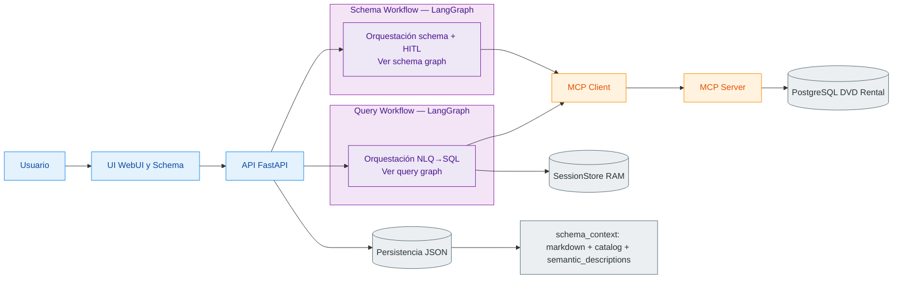

# Diagrama de arquitectura

Este diagrama muestra solo la arquitectura **a nivel de bloques**. El detalle de nodos/rutas internas vive en los diagramas específicos de cada workflow.

Detalle interno:

- Query Workflow: ver diagrama de query graph.
- Schema Workflow: ver diagrama de schema graph.
