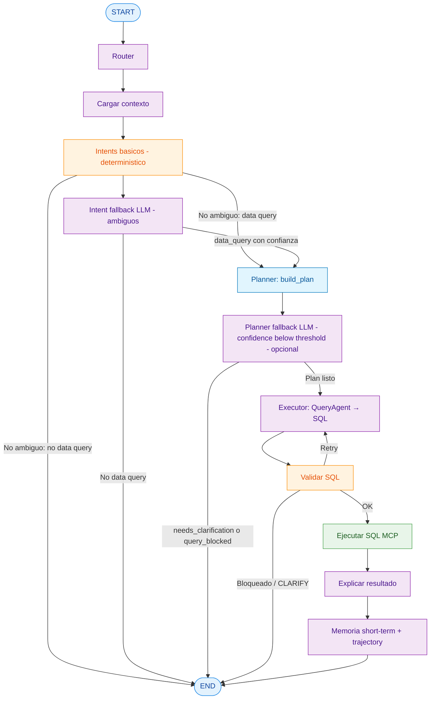

# Diagrama del Query Graph

Orden real del grafo (`build_query_graph` en `src/graph/query_workflow.py`): primero corre el router de intención con capa determinística y fallback LLM para casos ambiguos; luego planner (heurístico + fallback opcional) y recién después `QueryAgent` para draft SQL.

