# Diagrama de arquitectura

Los **workflows de LangGraph** aparecen como **subgrafos**: todo lo que hoy está cableado como nodos internos (router, planner, agente, validador, MCP, persistencia de sesión) queda **adentro** del contorno del workflow, no como cajas colgando afuera. La API entra a cada grafo por su primer nodo (`router · load · …`).

```mermaid
flowchart LR
    U[Usuario] --> UI[UI WebUI y Schema]
    UI --> API[API FastAPI]

    subgraph QW[Query Workflow — LangGraph]
        direction TB
        Q0[router · load · intents] --> PL[Planner build_plan]
        PL --> QA[QueryAgent NL→SQL]
        QA --> VAL[Validator + sql_safety]
        VAL --> QEX[Ejecutar SQL read-only]
        QEX --> QXP[explain + short_term + trajectory]
    end

    subgraph SW[Schema Workflow — LangGraph]
        direction TB
        S0[router · load estado] --> SIN[MCP inspect schema]
        SIN --> SDR[SchemaAgent draft_bundle]
        SDR --> SPE[Persistir / fin HITL]
    end

    API --> Q0
    API --> S0

    SIN --> MCPC[MCP Client]
    QEX --> MCPC
    MCPC --> MCPS[MCP Server]
    MCPS --> DB[(PostgreSQL DVD Rental)]

    API --> P[(Persistencia JSON)]
    SPE --> P
    QXP --> SESS[(SessionStore RAM)]

    P --> CTX[schema_context: markdown + catalog + semantic_descriptions]

    classDef ext fill:#E3F2FD,stroke:#1E88E5,color:#0D47A1,stroke-width:1px;
    classDef subgraphBox fill:#F3E5F5,stroke:#8E24AA,color:#4A148C,stroke-width:1px;
    classDef step fill:#EDE7F6,stroke:#7B1FA2,color:#4A148C,stroke-width:1px;
    classDef agent fill:#E8F5E9,stroke:#43A047,color:#1B5E20,stroke-width:1px;
    classDef planner fill:#E1F5FE,stroke:#0277BD,color:#01579B,stroke-width:1px;
    classDef mcp fill:#FFF3E0,stroke:#FB8C00,color:#E65100,stroke-width:1px;
    classDef data fill:#ECEFF1,stroke:#546E7A,color:#263238,stroke-width:1px;
    classDef persist fill:#E8F5E9,stroke:#2E7D32,color:#1B5E20,stroke-width:1px;

    class U,UI,API ext;
    class QW,SW subgraphBox;
    class Q0,QEX,QXP,S0,SIN step;
    class QA,VAL,SDR agent;
    class PL planner;
    class MCPC,MCPS mcp;
    class DB,P,SESS,CTX data;
    class SPE persist;
```

Vista simplificada del schema: el ramal **HITL resume** (`schema_hitl_resume` → reinspección → redraft) no se dibuja aquí; el detalle está en `schema-graph.md`.
