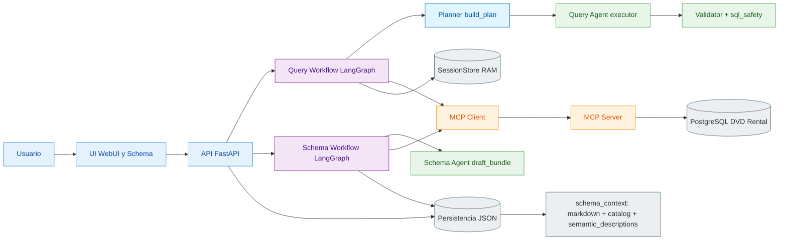

# Diagrama de arquitectura

Vista de componentes: el **Query Workflow** encadena planner heurístico (`build_plan`) → **Query Agent** (NL→SQL con `query_plan` en contexto) → **Validator**. El **Schema Workflow** usa **`draft_bundle`** y persiste **`semantic_descriptions`** junto al contexto. MCP centraliza schema + SQL read-only.

