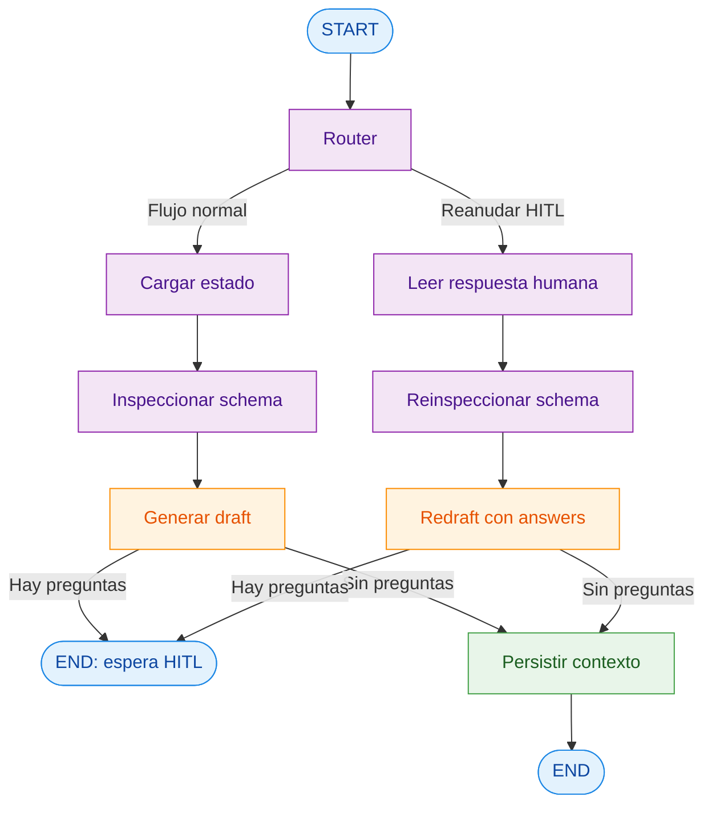

# Diagrama del Schema Graph

```mermaid
flowchart TD
    A([START]) --> R[Router]
    R -->|Flujo normal| L[Cargar estado]
    R -->|Reanudar HITL| H[Leer respuesta humana]

    L --> I[Inspeccionar schema]
    I --> D[Generar draft]
    D -->|Hay preguntas| Z([END: espera HITL])
    D -->|Sin preguntas| P[Persistir contexto]

    H --> I2[Reinspeccionar schema]
    I2 --> D2[Redraft con answers]
    D2 -->|Hay preguntas| Z
    D2 -->|Sin preguntas| P

    P --> F([END])

    classDef io fill:#E3F2FD,stroke:#1E88E5,color:#0D47A1,stroke-width:1px;
    classDef step fill:#F3E5F5,stroke:#8E24AA,color:#4A148C,stroke-width:1px;
    classDef decision fill:#FFF3E0,stroke:#FB8C00,color:#E65100,stroke-width:1px;
    classDef persist fill:#E8F5E9,stroke:#43A047,color:#1B5E20,stroke-width:1px;

    class A,F,Z io;
    class R,L,H,I,I2,D,D2 step;
    class D,D2 decision;
    class P persist;
```
